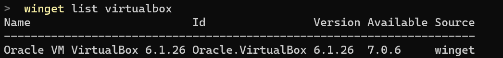
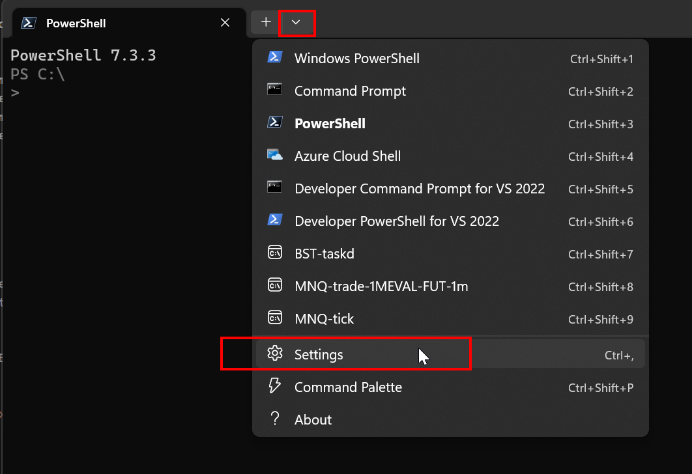
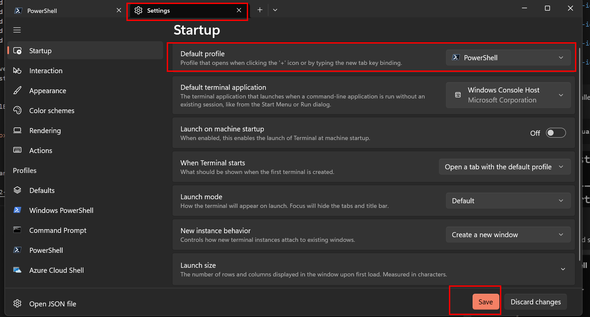
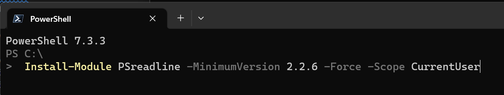
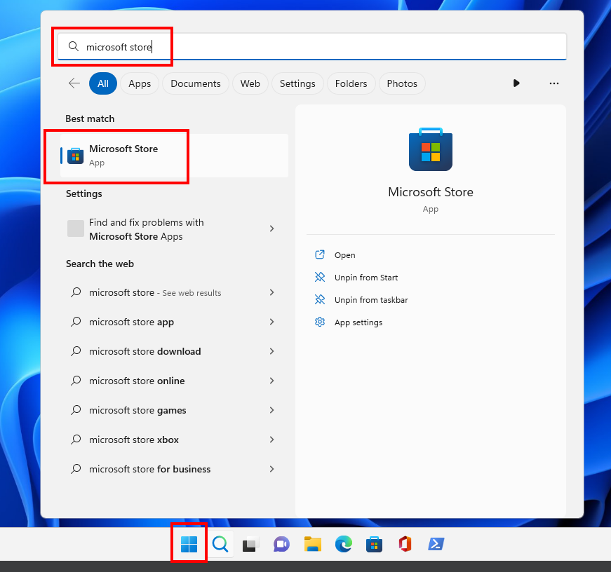

# Exercise 02: basic tooling

Please install the following software on your base OS using only `winget` or `homebrew`:
- PowerShell.
- Windows Terminal (only in case of using Windows as base OS).
- Nmap.
- Git.
- Postman.
- Google Chrome.
- Greenshot.
- VirtualBox.

For `winget` installation, use (suggestion is to run `cmd.exe` as an Administrator before running these commands):

```powershell
    winget install --name 'PowerShell' --id '9MZ1SNWT0N5D' --exact --source 'msstore' --accept-package-agreements --accept-source-agreements --silent
    winget install --name 'Windows Terminal' --id '9N0DX20HK701' --exact --source 'msstore' --accept-package-agreements --accept-source-agreements --silent
    winget install --id 'Git.Git' --source 'winget' --accept-package-agreements --accept-source-agreements --silent
    winget install --id 'Postman.Postman' --source 'winget' --accept-package-agreements --accept-source-agreements --silent
    winget install --id 'Google.Chrome' --source 'winget' --accept-package-agreements --accept-source-agreements --silent
    winget install --id 'Greenshot.Greenshot' --source 'winget' --accept-package-agreements --accept-source-agreements --silent
    winget install --id 'Oracle.VirtualBox' --source 'winget' --accept-package-agreements --accept-source-agreements --silent
```

You can verify if you've installed each software by running the following command. If you get at least one record is because you've successfully installed the software.

```powershell
    winget list VirtualBox
```



## Configuration

1. Open Windows Terminal and set your default profile to `PowerShell`:


 


2. Open Windows Terminal with PowerShell (don't confuse it with `Windows PowerShell`, which is different) and run the following command: 

```powershell
    Install-Module PSreadline -MinimumVersion 2.2.6 -Force -Scope CurrentUser
```



## Possible errors

If you find you don't have installed `winget`, open Microsoft Store for the first time and it should get installed automatically. Then, just try again.

